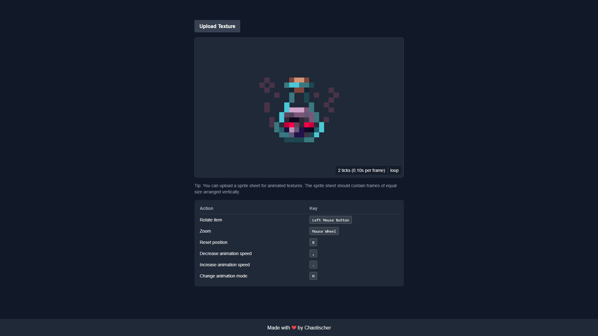

# 🧱 Minecraft Item Renderer

A tool that renders Minecraft item textures (`.png`) as 3D-style models using Vue.js and TypeScript. This project allows you to view and interact with Minecraft items in 3D directly in your browser, with support for animated textures.

## 🔗 Demo

You can see a live demo of the project [here](https://render.chaotischer.de/).

## 🚀 Features

- **3D Rendering:** Converts Minecraft item textures into layered 3D models
- **Animation Support:** Handles vertical sprite sheets for animated textures
- **Multiple Animation Modes:** Loop, Reverse, and Bounce animations
- **Minecraft-style Timing:** Uses Minecraft's tick system (20 ticks = 1 second)
- **Interactive Controls:** Rotate, zoom, and reset view
- **Pixelated Rendering:** Maintains Minecraft's iconic visual style

## 🖼️ Preview



## 🛠️ Installation

To build the project locally, follow these steps:

1. Clone the repository:
   ```bash
   git clone https://github.com/chaotischer/minecraft-item-renderer/
   cd minecraft-item-renderer
   ```

2. Install dependencies:
   ```bash
   npm install
   ```

3. Run the development server:
   ```bash
   npm run dev
   ```

4. Open your browser and navigate to [http://localhost:3000](http://localhost:3000).

## 💡 How It Works

The Minecraft Item Renderer creates 3D representations of items using the following techniques:

### Basic Rendering
- Takes a square PNG texture (e.g., 16x16 pixels)
- Creates 16 layers of the texture stacked in 3D space
- Applies pixelated rendering to maintain Minecraft's iconic look
- Allows rotation and zoom interaction for viewing from different angles

### Animation Support
- Accepts vertical sprite sheets for animated textures
- Automatically detects frames by dividing the image height by its width
- Supports three animation modes:
  - **Loop**: Plays frames in sequence (1 → 2 → 3 → 1)
  - **Reverse**: Plays frames backwards (3 → 2 → 1 → 3)
  - **Bounce**: Plays frames back and forth (1 → 2 → 3 → 2 → 1)
- Animation speed is controlled using Minecraft's tick system (20 ticks = 1 second)

### Controls
- Left Mouse Button: Rotate the item in 3D space
- Mouse Wheel: Zoom in/out
- R Key: Reset item position
- , and . Keys: Adjust animation speed (1-20 ticks)
- M Key: Switch between animation modes

### Technical Implementation
- Uses Vue.js for UI components and state management
- Implements CSS 3D transforms for the rendering
- Handles sprite sheet parsing using HTML Canvas
- Maintains pixelated texture quality using `image-rendering: pixelated`
- Organized using composables for animation and texture handling

## 🧑‍💻 Development

The project is structured using Vue.js best practices:

- `components/` - Vue components including the main renderer
- `composables/` - Reusable logic for animation and texture handling
- `layouts/` - Page layouts and structure
- `pages/` - Application routes and pages

## 🔧 Build

To build the project for production:

```bash
npm run build
```

Then, start the production server:

```bash
npm run start
```

## 📝 License

This project is licensed under the MIT License - see the [LICENSE](LICENSE) file for details.

## 💖 Credits

- Made with ❤️ by Chaotischer

- The default animated textures shown when loading the page are from the ["Animated Items" resource pack](https://modrinth.com/resourcepack/animated-items) by vrabb-gh.
  - The following items from the resource pack may be included as default textures:
      - Breeze Rod
      - Golden Apple
      - Ominous Bottle
      - Salmon Bucket
  - Please respect the original resource pack's CC-BY-NC-4.0 license when using these textures. 